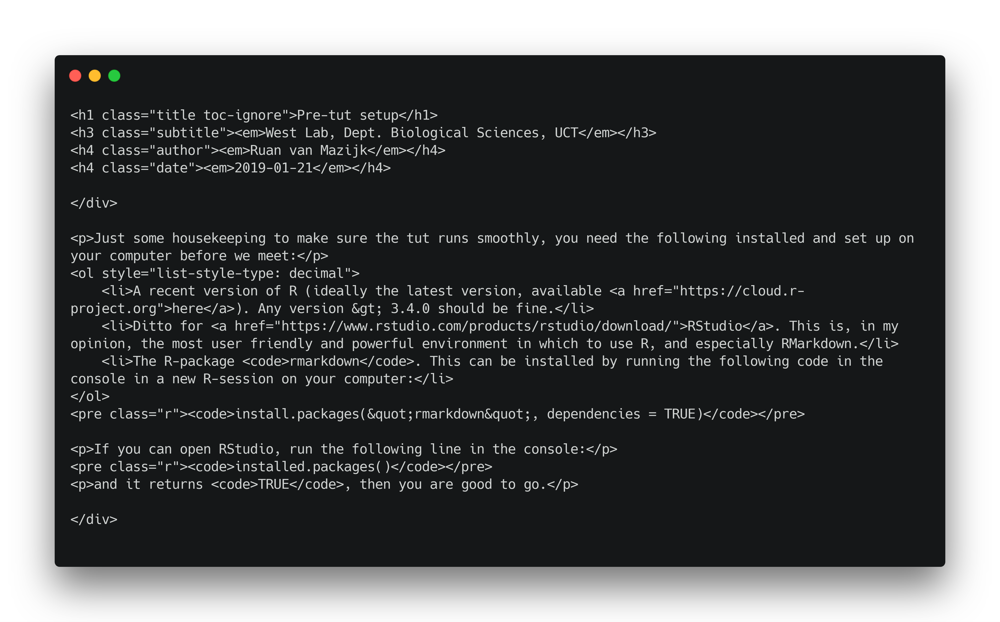
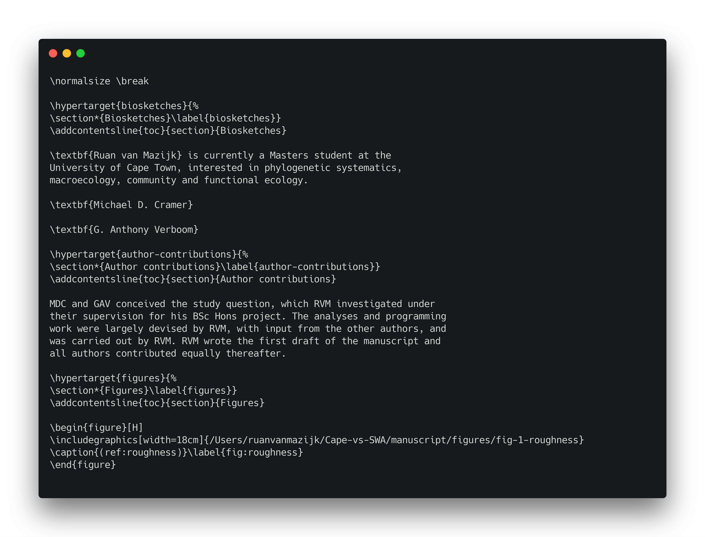
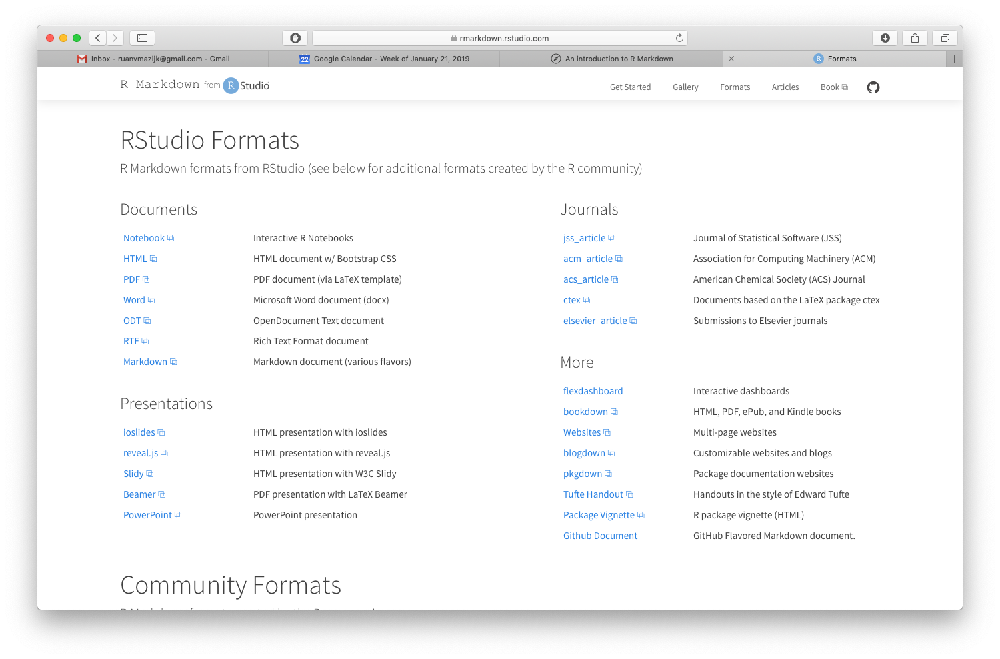

Please refer to the [pre-tut setup](pre-tut-setup.html), if you haven't already, before we begin.

# What is R Markdown?

R Markdown is a document preparation system, like MS Word, but completely different. Importantly, it works in plain-text and is highly accessible, open source, and makes it really easy to embed R-code in documents (e.g. to create figures or tables).

***

## Document preparation systems

Document prep systems vary. There are those where what you **see** is what you **get** in the final document ("WYSIWYG"-systems; e.g. MS Word), and there are those where what you **see** is what you **mean** ("WYSIWYM"-systems; e.g. markup languages such as HTML, LaTeX).

R Markdown is based on the markup language "Markdown". Mark**down** was invented to be a simpler alternative to more complicated mark**up** languages like HTML and LaTeX. These markup languafes are often quite hard to read in raw-form and even harder to write. See for yourself:

***



***



# The benefits of R Markdown

What R Markdown does is extend Markdown by making R-code (and other programming languages) executable from within the document's source file, allowing the results to show up in the final document (e.g. figures or tables), thereby "weav[ing] together narrative text and code to produce elegantly formatted output" (<https://rmarkdown.rstudio.com>).

It also adds a bit more functionality to Markdown with simple syntax for in-text references, equations, and more.

And, best of all, it makes the results of any analysis fully reproducible!

# How does R Markdown work?

R Markdown takes the file you write (e.g. `analysis.Rmd`), converts it to plain markdown using the R-package `knitr`, then converts it any of the output formats you choose, using the open source software `pandoc`.


# Possible output formats



***

An R Markdown (`.Rmd`) file has two main components:

1. the YAML header
2. and the body

# Example

`analysis.Rmd` might look like this:

    ---
    title: My analysis
    author: Ruan van Mazijk
    date: 2019-11-15
    output: html_document
    ---
    
    # Introduction
    
    Blah blah blah blah ...
    
    # Methods
    
    Etc. etc. etc. ...

***

## Rendering your document

Use the output specified in the header

    rmarkdown::render("analysis.Rmd")

Or over-ride it

    rmarkdown::render("analysis.Rmd"
      output_format = "pdf_document"
    )

***

## Using Markdown-style markup

***

### Headings

    # A heading
    
    ## A sub-heading
    
    ### A sub-sub-heading
    
    (Can go down 6 levels)

***

### Unordered lists

    - Item
    - Item
    - Item
      - Sub-item
      - Sub-item
        - Sub-sub-item
        - Etc.
***

### Unordered lists cont.

- Item
- Item
- Item
  - Sub-item
  - Sub-item
    - Sub-sub-item
    - Etc.

***

### Ordered lists
    
    1. Item
    2. Item
    3. Item
      a. Sub-item
      b. Sub-item
        1. Sub-sub-item
        2. Etc.

***

### Ordered lists cont.

1. Item
2. Item
3. Item
    a. Sub-item
    b. Sub-item
        1. Sub-sub-item
        2. Etc.

***

### Simple tables

    Column1 | Column2 | Column 3
    --------|---------|---------
    Row1    |         |
    Row2    |         |
    Row3    |         |

***

### Simple tables cont.

Column1 | Column2 | Column 3
--------|---------|---------
Row1    |         |
Row2    |         |
Row3    |         |

***

### Comments

    <!--A comment-->
    <!--(won't get rendered in any of the final output(s))-->

***

### Citations

You need a `.bib` file, which looks like this (e.g. `example.bib`):

    @article{West2018,
     author = {West, A.G. et al.},
     year = {2018},
     title = {A previous study},
     journal = {Nature},
     number = {50},
     volume = {49},
     pages = {340--346}
    }
    @article{West2017,
     ...
    }

(Mendeley and other reference managing software can easily generate this file for you from your library.)

***

And link it to `analysis.Rmd` in the YAML header:

    ---
    ...
    bibliography: example.bib
    ---

***

By adding the following heading to the end of `analysis.Rmd`:

    # References

It will automatically produce the reference list!

***

    Our study aligns with previous findings
    [@paper1; @paper2].

***

Our study aligns with previous findings [@paper1; @paper2].

***

### R-code

We can embed figures in our document. `echo=FALSE` tells R Markdown not to display the code chunk that generates the figure.

    \    ```{r, echo=FALSE}
    \    plot(cars)
    \    ```

(Ignore the backslashes)

***

### R-code cont.

```{r, echo=FALSE}
plot(cars)
```

***

Alternatively, we can set `echo=TRUE`:

    \    ```{r, echo=TRUE}
    \    x <- 1:100
    \    y <- 3 * jitter(x, 100)
    \    m <- lm(y ~ x)
    \    visreg::visreg(m)
    \    ```

***

```{r}
x <- 1:100
y <- 3 * jitter(x, 100)
m <- lm(y ~ x)
visreg::visreg(m)
```

# A _live-coding_ example!

...

# Further reading

R Markdown "Getting Started" Tutorial. <https://rmarkdown.rstudio.com/lesson-1.html>.

R Mardown Cheatsheet. <https://rmarkdown.rstudio.com/lesson-15.html>.

R Markdown Reference Guide. <https://www.rstudio.com/wp-content/uploads/2015/03/rmarkdown-reference.pdf>.

Yihui, X., Allaire, J.J., Grolemund, G. (2018). R Markdown: The Definitive Guide. <https://bookdown.org/yihui/rmarkdown/>.

# References
