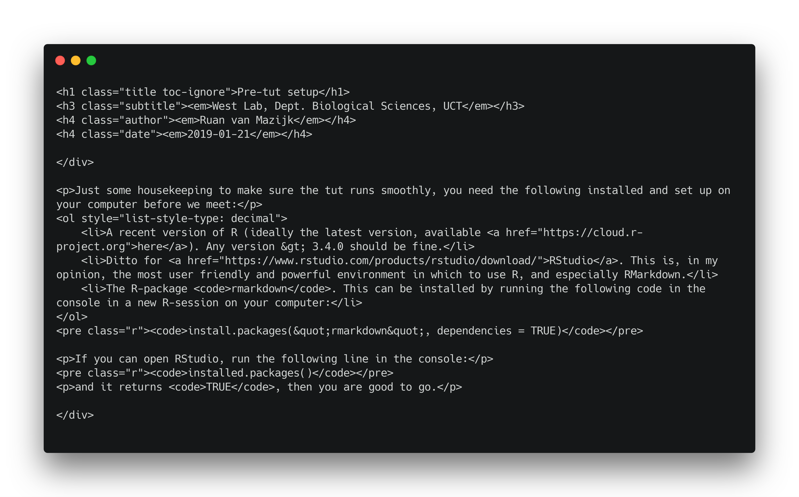
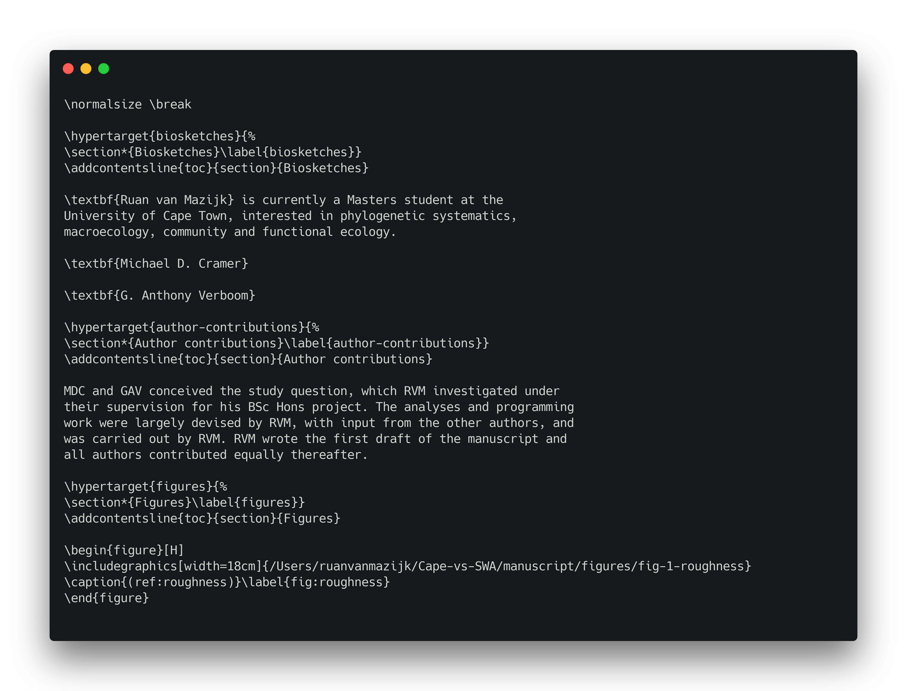

```{r setup, include=FALSE}
knitr::opts_chunk$set(echo = TRUE)
```

Please refer to the [pre-tut setup](pre-tut-setup.html), if you haven't already, before we begin.

# What is RMarkdown?

RMarkdown is a document preparation system, like MS Word, but completely different. Keyly, it works in plain-text and is highly accessible, open source, and makes it really easy to embed R-code in documents (e.g. to create figures or tables).

# Document prep systems

Document prep systems vary. There are those where what you **see** is what you **get** in the final document ("WYSIWYG"-systems; e.g. MS Word), and there are those where what you **see** is what you **mean** ("WYSIWYM"-systems; e.g. markup languages such as HTML, LaTeX).

RMarkdown is based on the markup language "Markdown". Mark**down** was invented to be a simpler alternative to more complicated mark**up** languages like HTML and LaTeX. These markup languafes are often quite hard to read in raw-form and even harder to write. See for yourself:

***



***



***

# How does RMarkdown work?

RMarkdown sends ...
